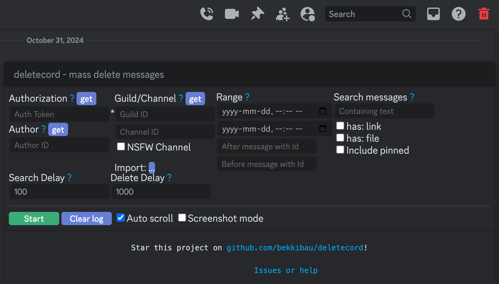
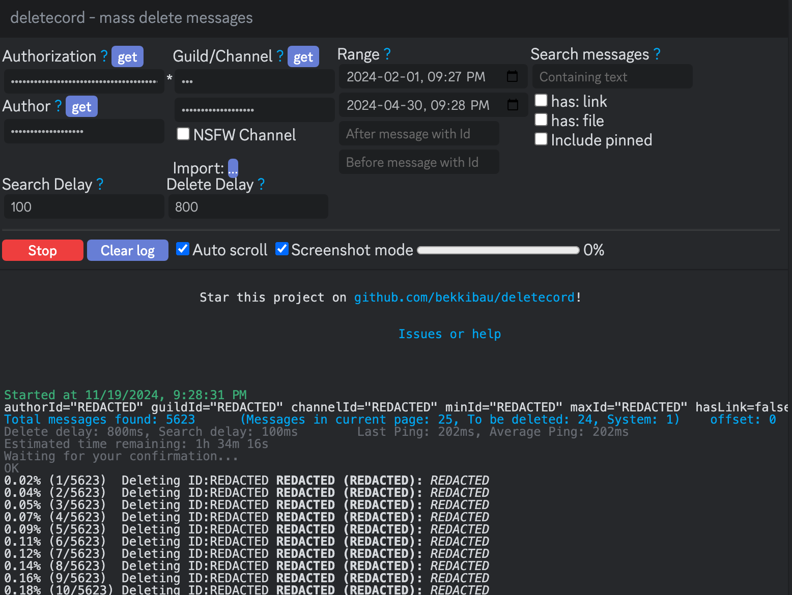
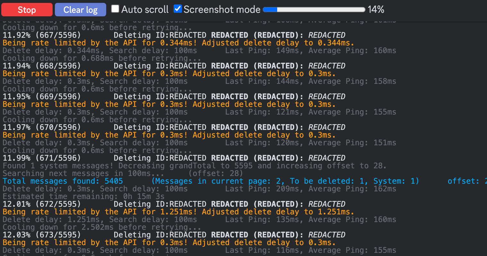
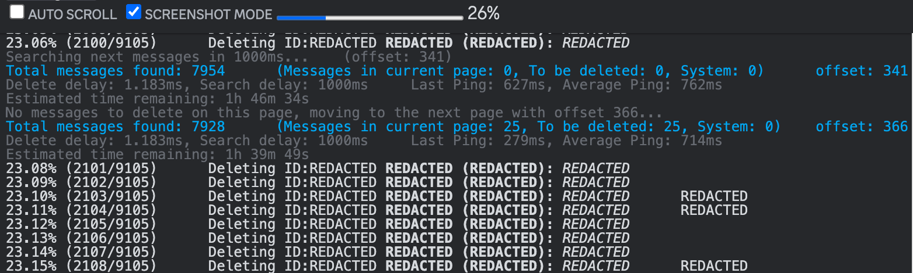
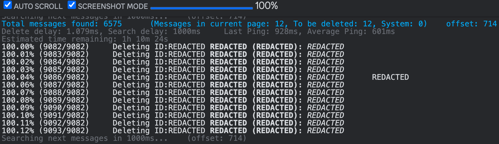
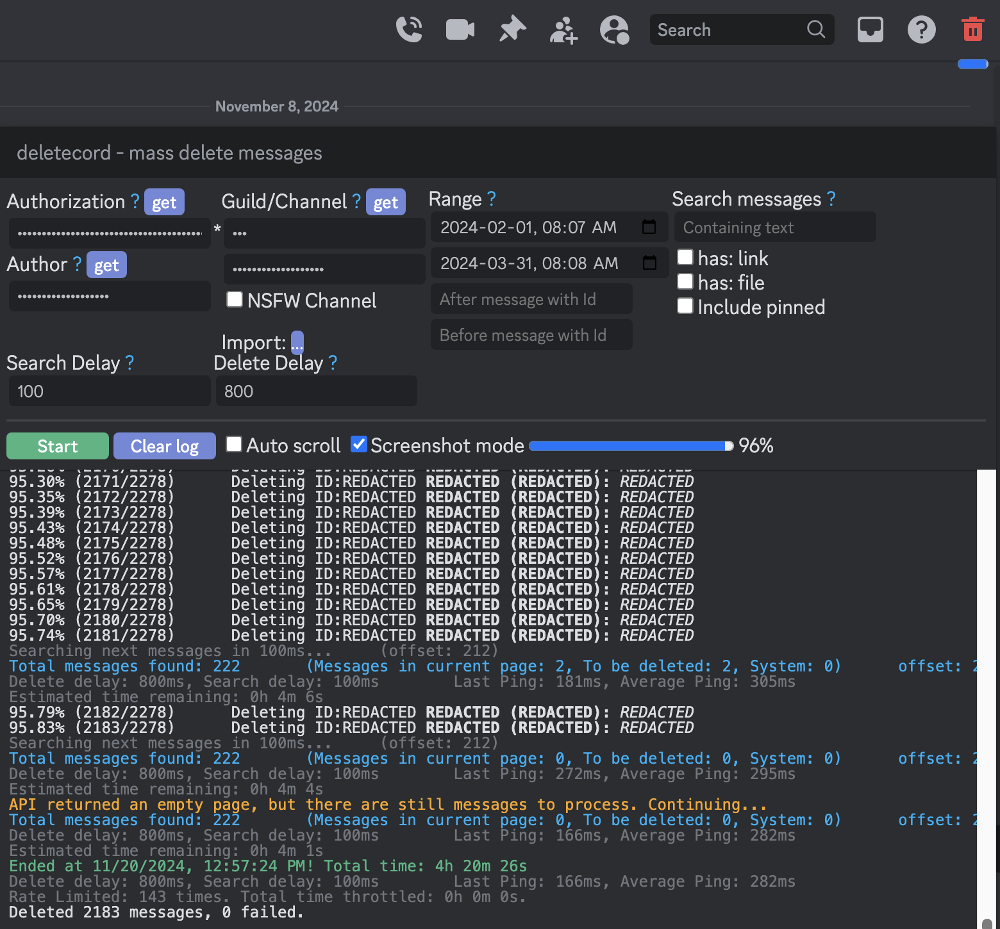
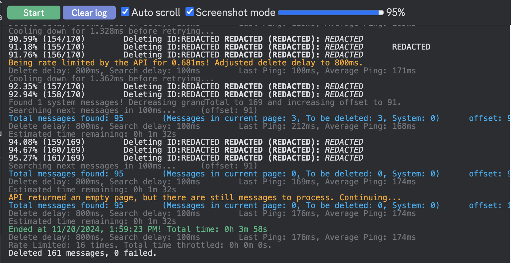
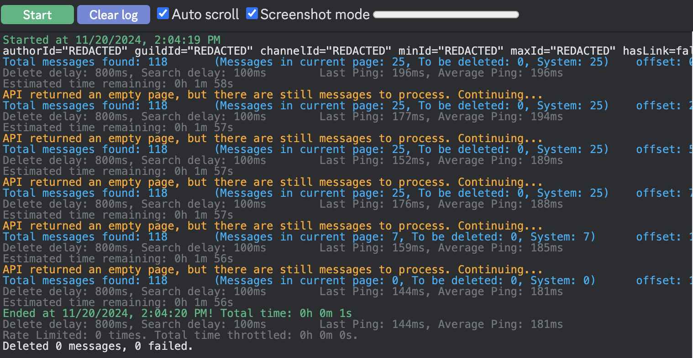

# [deletecord](https://bekkibau.github.io/deletecord) 

[website](https://bekkibau.github.io/deletecord) / [greasyfork](https://greasyfork.org/en/scripts/518587-deletcord-delete-all-messages-in-a-discord-channel-or-dm-mass-deletion) / [github](https://github.com/bekkibau/deletecord)  

mass delete all discord messages from any dm or channel  

# how to use
### prereq
download a userscripts manager (eg. [ViolentMonkey](https://violentmonkey.github.io)) 
> [!NOTE] 
Chrome users: ViolentMonkey is unsupported due to extension Manifest V2 deprecation. A temporary workaround is needed: [steps to allow legacy extension manifest version flag](https://github.com/violentmonkey/violentmonkey/issues/2284#issuecomment-2709021118) 
### steps
1. download this script from [GreasyFork](https://greasyfork.org/en/scripts/518587-deletcord-delete-all-messages-in-a-discord-channel-or-dm-mass-deletion) or the JS file here
2. open [discord](https://discord.com/app) in the browser
3. enable script
4. open the dm or channel where you want to delete the messages
5. press the new `trash icon` in top right-hand corner
6. press all the blue `get` buttons in the popup
7. configure [options](#options) (default: all)
8. press green `start` button
9. wait for it to finish (can take many hours!)
10. `prevent automatically sleeping on power adapter` (optional -> see green tip below)
11. rerun a few more times to delete any skipped messages (quicker than first time)
> [!IMPORTANT]  
I recommend you skim through the entire chat to confirm if all messages are deleted. If not simply re-run until all done (sorry this is a bug - its not perfect, but still better than manually deleting single msgs imo)

13. `re-enable allowing computer to sleep` (optional -> see green tip below)
14. done! - you can disable the userscript until the next time you need it

> [!TIP]
you only need to prevent sleep if you have a lot of messages to delete and/or will likely not be using your computer the whole time (ie. display turns off and computer sleeps) (instructions for [macOS](https://support.apple.com/en-ca/guide/mac-help/mchle41a6ccd/mac), please google and share for other OS)

# options
self-explanatory. refer to the [forked wiki](https://github.com/bekkibau/deketecord/wiki) if you need more info

find `message ids` by right-clicking them  
adjust `delay` in ms to test for optimal deletion rate 
- `Range`
    - `before date`
    - `after date`
    - `After message id`
    - `Before message id`  
- `Search Delay` rec: 1000
- `Delete Delay` rec: 800
- `Search messages`
    - `Containing Text`  
    - `Has: Link`
    - `Has: File`
    - `Include Pinned`

# tested
### default

### options selected
sample options for dm - here i pressed the `get` buttons, selected `date range` and adjusted the `delete delay` with `screenshot mode`

### starting...
this is what it looks like right after pressing `start`. total number of messages to delete (might be slightly inaccurate due to system messages)

### while running (ratelimited)

when rate limited, might only delete 1-3 messages are between short delays. The script adjusts the delete api call delays according to  response (usually 0.5 - 2 ms) 

### while running for dms (not ratelimited)
when not being ratelimited, it goes pretty fast.

### bug - miscalculating deleted percent
bug where percent deleted exceeds or below 100% -- i think it might be off by ~1000s of messages. you can see the datetime of the latest messages deleted and estimate how many are left since the beginning / end of your messaging history until this is fixed 

### bug - done
once all messages are found and deleted, the script will end automatically. I recommend you press `start` again to delete any messages it missed - not sure why this happens, but its only a small percent that get missed

### bug - rerun
only few 100s of messages were found the 2nd time, idk im paranoid so, run it few more times just in case!

### 0 messages left
after rerunning obsessively, it'll eventually get to 0. I recommend you skim through the entire chat to confirm.

# untested
I didn't test all the features so, read up on it in [wiki](https://github.com/bekkibau/deletecord/wiki) and use at your own risk the following features:
- non-chrome browser
- NSFW
- Import
- after message id
- search message
- manually entering the `get` values

# contributing
I'll accept easy to review changes (eg. few lines of code & test screenshots) or steps (screenshots) on how to make it work for other browser / OS.

I don't plan to maintain this regularly, but I can confirm it works as of this initial upload date. I might have to update it the next time I send a lot of regrettable message to someone. If [victornpb/undiscord](https://github.com/victornpb/undiscord) becomes active again, I'll likely cherry-pick commits into this fork to have my own copy. 

# references

this is an active fork of [victornpb/undiscord](https://github.com/victornpb/undiscord) which hasn't been updated in over a year, so i forked it to fix small bugs. I've only fixed the bugs that made the script pause or quit prematurely - i didn't add any new features.

If this ever breaks, I recommend you first check out: 
- [victornpb userscript](https://greasyfork.org/en/scripts/406540-undiscord)
- [victornpb gist](https://gist.github.com/victornpb/135f5b346dea4decfc8f63ad7d9cc182)
- [victornpb discussions](https://github.com/victornpb/undiscord/discussions)

# privacy policy
i adhere to the original creator's [Privacy Policy](https://github.com/bekkibau/deletecord/wiki/Security-Policy)

> [!WARNING]  
discord explicity prohibits the use of unauthorized third-party scripts through their [TOS](https://discord.com/terms). so, usage of this script can result in consequences such as account suspension, bans, etc. personally haven't had issues but, please use at your own risk. 
